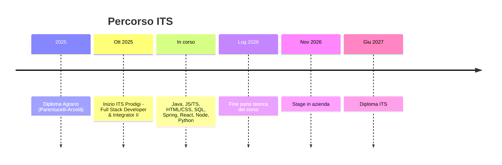

<!-- ====== HEADER ====== -->

<h3 align="center">Studente ITS Full Stack Developer — alla ricerca del primo stage</h3>

  

  
  
  

 

<!-- ====== SU DI ME ====== -->
## 👨‍💻 Su di me

- 🎓 Studio presso **ITS Academy Prodigi** — corso *Full Stack Developer & Integrator II* (sede Pisa Copernico)
- 📚 Corso **attualmente in svolgimento**: tutte le materie e le tecnologie elencate qui sotto verranno completate **entro agosto 2026**
- 🗓️ Fine parte teorica: **Luglio 2026** · Diploma previsto: **Giugno 2027**
- 🌱 Sto approfondendo lo sviluppo **full stack** e l'architettura delle applicazioni web
- 💼 In cerca di un'opportunità di **stage** a partire da **Novembre 2026**
- 🎾 Sport agonistico (tennis, beach tennis, karate): la disciplina l'ho portata nel codice
- 📫 **dieegobarbagallo@gmail.com**

 

<!-- ====== TECH STACK ====== -->
## 🛠️ Tech Stack

**Linguaggi**

**Framework & Librerie**

**Database**

**Strumenti**

<!-- ====== ROADMAP ====== -->
## 🗺️ Il mio percorso verso lo stage

<!-- ====== FOCUS ATTUALE ====== -->
## 🎯 Cosa sto facendo ora

- 🔥 Costruendo **API REST** robuste e scalabili lato back-end
- 🌐 Consolidando **JavaScript / Node.js / Express**
- ⚛️ Studiando **React** per il front-end e aprendomi a **React Native** per il mobile
- 🐳 Imparando **Docker** e i principi di base del DevOps
- 🧪 Costruendo piccoli progetti dopo ogni argomento, per imparare facendo

<!-- ====== SEPARATORE ====== -->

  
  

<!-- ====== CONTATTI ====== -->
## 📫 Come contattarmi

  
  

 

<i>"Code every day to get a little better."</i>

